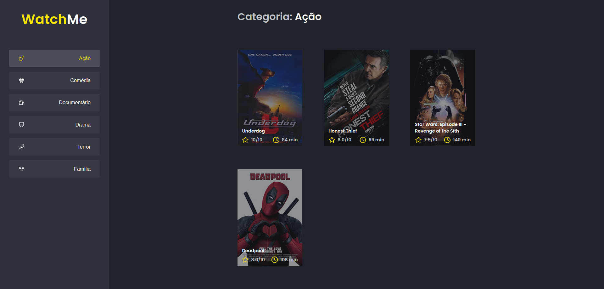

<h2 align="center">
   Watch Me | 
</h2>

<p align="center">
  
  
  
</p>

---

## 💻 Apresentação

**Watch Me** é uma aplicação onde lista filmes separados por gênero.

- A aplicação possui apenas uma funcionalidade principal que é a listagem de filmes;
- Na sidebar é possível selecionar qual categoria de filmes deve ser listada;
- A primeira categoria da lista (que é "Ação") já deve começar como marcada;
- O header da aplicação possui apenas o nome da categoria selecionada que deve mudar dinamicamente.

Descrição completa dos desafios:
- [Componentizando a aplicação](./docs/01%20-%20Componentizando%20a%20aplica%C3%A7%C3%A3o/Componentizando%20a%20aplica%C3%A7%C3%A3o.md)
- [Otimizando a aplicação](./docs/02%20-%20Otimizando%20a%20aplica%C3%A7%C3%A3o/Otimizando%20a%20aplica%C3%A7%C3%A3o.md)


## 🧭 Como rodar o projeto

**Instale as dependências**

```bash
npm install
```

**Execute a aplicação**

```bash
npm run dev
```
*O projeto irá executar em **http://localhost:8080/***


**Execute Fake API**
```bash
npm run server
```
*O servidor fake irá executar em **http://localhost:3333/genres** e **http://localhost:3333/movies***

## 🚀 Tecnologias

Esse projeto foi desenvolvido com as seguintes tecnologias:

- [ReactJS](https://pt-br.reactjs.org/)
- [SASS](https://sass-lang.com/)
- [TypeScript](https://www.typescriptlang.org/pt/)
- [Webpack](https://webpack.js.org/)

## 📝 Licença

Esse projeto está sob a licença MIT. Veja o arquivo [LICENSE](LICENSE) para mais detalhes.
