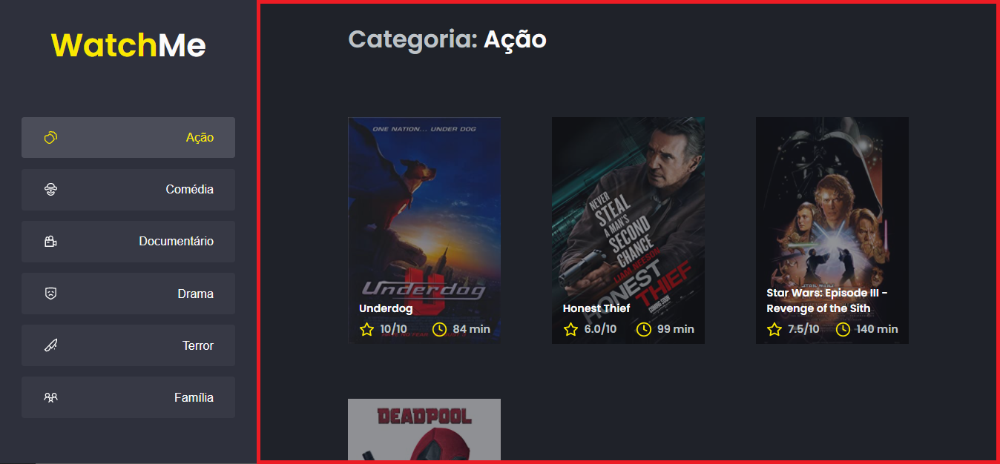

# 💻 Sobre o desafio

Nesse desafio você deverá performar uma aplicação React utilizando das ferramentas e dicas aprendidas durante o módulo **Performando apps com ReactJS**.

Se você fez o desafio opcional [Componentizando a aplicação](https://www.notion.so/Desafio-02-Componentizando-a-aplica-o-22cd79dfb65b48d9bfb376bc0ca10297) deve lembrar que se trata de uma aplicação que exibe uma listagem de filmes por categoria com base na categoria selecionada e que esses dados vem de uma API (fake API com JSON Server).

Com essa aplicação componentizada, você deve aplicar os conceitos de performance no React para melhorar esse app.

---

*Mas eu não fiz o desafio opcional. Preciso fazer ele antes para conseguir fazer esse?*

Se você não fez o desafio opcional, não precisa voltar atrás para concluir ele antes de fazer esse (apesar de que prática nunca é demais 😉). Para isso, estará disponibilizado aqui um template com o código componentizado, de onde você pode partir para realizar esse desafio.

A seguir veremos com mais detalhes o que e como precisa ser feito 🚀

## Template da aplicação

Como mencionado acima, se você não fez o desafio [Componentizando a aplicação](https://www.notion.so/Desafio-02-Componentizando-a-aplica-o-22cd79dfb65b48d9bfb376bc0ca10297), pode usar o seguinte template como ponto de partida para esse desafio. Caso contrário, é possível apenas aprimorar o seu código a partir do que já foi feito.

O template está disponível na seguinte URL: 

[GitHub - /rocketseat-education/ignite-template-otimizando-a-aplicacao](https://github.com/rocketseat-education/ignite-template-otimizando-a-aplicacao)

**Dica**: Caso não saiba utilizar repositórios do GitHub como template, temos um guia em **[nosso FAQ](https://www.notion.so/FAQ-Desafios-ddd8fcdf2339436a816a0d9e45767664).**

## Se preparando para o desafio

Para esse desafio, além dos conceitos vistos em aula utilizaremos algumas coisa para deixar a nossa aplicação ainda melhor. Por isso, antes de ir diretamente para o código do desafio, explicaremos um pouquinho sobre Fake API com JSON Server (se você já entende o que é e como funciona o JSON Server, pode pular [para a próxima seção](Desafio%2001%20-%20Otimizando%20a%20aplicac%CC%A7a%CC%83o.md)).

### Fake API com JSON Server

Nesse desafio vamos utilizar o JSON Server para simular uma API que possui as informações de gêneros e filmes. 

Navegue até a pasta criada, abra no Visual Studio Code e execute os seguintes comandos no terminal:

```bash
yarn # instala as dependências
yarn server # inicia o servidor com o JSON Server na porta 3333
```

Em seguida, você vai ver a mensagem:


Perceba que ele iniciou uma fake API com os recursos `/genres` e `/movies` em `localhost` na porta `3333` a partir das informações do arquivo [server.json](https://github.com/danilo-vieira/ignite-template-otimizando-a-aplicacao/blob/main/server.json) localizado na raiz do seu projeto. 

Acessando essas rotas no seu navegador, você consegue ver o retorno das informações já em JSON (dando um clique duplo, a imagem se expandirá):


Dessa forma, basta consumir essas rotas da API normalmente com o Axios. 

Caso queira estudar mais sobre o **JSON Server**, dê uma olhada aqui:

[typicode/json-server](https://github.com/typicode/json-server)

## O que devo editar na aplicação?

Com o template já clonado, as dependências instaladas e a fake API rodando, você deve começar implementar as estratégias de otimização para a aplicação.

Aqui estão os dois principais arquivos que devem ser editados:

- **[src/App.tsx](https://github.com/danilo-vieira/ignite-template-otimizando-a-aplicacao/blob/main/src/App.tsx)**
Esse é o componente principal da aplicação e contém toda a lógica da aplicação como chamadas à API e controle de estados dos componentes Content e SideBar.
- **[src/components/Content.tsx](https://github.com/danilo-vieira/ignite-template-otimizando-a-aplicacao/blob/main/src/components/Content.tsx)**
Esse componente, possui toda a lógica e corpo responsável pelo header e conteúdo da aplicação (seção contornada em vermelho):




- **[src/components/SideBar.tsx](https://github.com/danilo-vieira/ignite-template-otimizando-a-aplicacao/blob/main/src/components/SideBar.tsx)**
Esse componente possui toda a lógica e corpo responsável pela seção que contém o título do site e a parte de navegação à esquerda da página (seção contornada em vermelho):


Se você preferir, pode também componentizar algumas outras partes da aplicação como, por exemplo, o header, mas esse não está como requisito deste desafio 🚀

## Dicas

Lembre-se de usar corretamente as funcionalidades do React para prover mais performance para a aplicação:

memo;

useMemo;

useCallback;

Mesmo que a aplicação não precise de alguns pontos de otimização, sinta-se livre para usar as ferramentas a sua disposição como forma de aprendizado mas continue tomando cuidado com otimizações desnecessárias ao trabalhar com algum projeto real 💜.

## Como deve ficar a aplicação ao final?

Está com dúvidas (ou curioso 👀) para ver como deve ficar a aplicação ao final do desafio? Deixamos abaixo um vídeo mostrando as principais funcionalidades que você deve implementar para te ajudar (ou matar sua curiosidade 👀).

https://user-images.githubusercontent.com/52754546/198945730-de1ad734-bfef-4c2e-9023-1b3fdb2ecb93.mp4

# 📅 Entrega

Esse desafio deve ser entregue a partir da plataforma da Rocketseat. Envie o link do repositório que você fez suas alterações. Após concluir o desafio, além de ter mandado o código para o GitHub, fazer um post no LinkedIn é uma boa forma de demonstrar seus conhecimentos e esforços para evoluir na sua carreira para oportunidades futuras.

Feito com 💜 por Rocketseat 👋 Participe da nossa [comunidade aberta!](https://discord.gg/pUU3CG4Z)