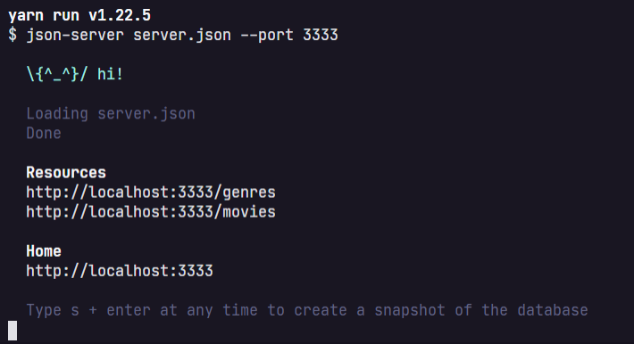
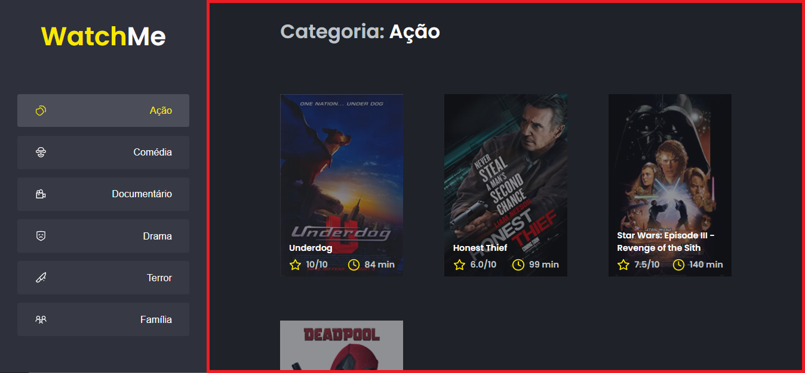

# Desafio 02 - Componentizando a aplicação

Módulo: Módulo 1
Status: In progress
Trilha: React

# 💻 Sobre o desafio

Nesse desafio, você deverá criar uma aplicação para treinar o que aprendeu até agora no ReactJS

Essa será uma aplicação onde o seu principal objetivo é refatorar uma página para listagem de filmes de acordo com gênero. 

A aplicação já está totalmente funcional mas grande parte do seu código está diretamente no arquivo `App.tsx`. Para resolver isso da melhor forma, é necessário dividir a aplicação em **pelo menos** duas partes principais: sidebar e o conteúdo principal que possui o header e a listagem de filmes.

- A aplicação possui apenas uma funcionalidade principal que é a listagem de filmes;
- Na sidebar é possível selecionar qual categoria de filmes deve ser listada;
- A primeira categoria da lista (que é "Ação") já deve começar como marcada;
- O header da aplicação possui apenas o nome da categoria selecionada que deve mudar dinamicamente.

A seguir veremos com mais detalhes o que e como precisa ser feito 🚀

## Template da aplicação

Para realizar esse desafio, criamos para você esse modelo que você deve utilizar como um template do GitHub.

O template está disponível na seguinte URL:

[rocketseat-education/ignite-template-componentizando-a-aplicacao](https://github.com/rocketseat-education/ignite-template-componentizando-a-aplicacao)

**Dica**: Caso não saiba utilizar repositórios do GitHub como template, temos um guia em **[nosso FAQ](https://www.notion.so/FAQ-Desafios-ddd8fcdf2339436a816a0d9e45767664).**

## Se preparando para o desafio

Para esse desafio, além dos conceitos vistos em aula utilizaremos algumas coisa novas para deixar a nossa aplicação ainda melhor. Por isso, antes de ir diretamente para o código do desafio, explicaremos um pouquinho sobre Fake API com JSON Server.

### Fake API com JSON Server

Assim como utilizaremos o MirageJS no módulo 2 para simular uma API com os dados das transações da aplicação dt.money, vamos utilizar agora o JSON Server para simular uma API que possui as informações de gêneros e filmes. 

Navegue até a pasta criada, abra no Visual Studio Code e execute os seguintes comandos no terminal:

```bash
yarn
yarn server
```

Em seguida, você vai ver a mensagem:




Perceba que ele iniciou uma fake API com os recursos `/genres` e `/movies` em `localhost` na porta `3333` a partir das informações do arquivo [server.json](https://github.com/rocketseat-education/ignite-template-componentizando-a-aplicacao/blob/main/server.json) localizado na raiz do seu projeto. Acessando essas rotas no seu navegador, você consegue ver o retorno das informações já em JSON (dando um clique duplo, a imagem se expandirá):


Dessa forma, basta consumir essas rotas da API normalmente com o Axios. Caso queira estudar mais sobre o **JSON Server**, dê uma olhada aqui:

[typicode/json-server](https://github.com/typicode/json-server)

## O que devo editar na aplicação?

Com o template já clonado, as dependências instaladas e a fake API rodando, você deve criar **pelo menos** os componentes SideBar e Content que já estão com os arquivos criados.
Os arquivos a serem editados são:

- **src/App.tsx**
Esse componente contém toda a aplicação com exceção do componente `Button` que não precisa ser alterado e `Icon` que também não precisa de alteração.
- **src/components/Content.tsx**
Esse componente, ainda vazio, deve possuir toda a lógica e corpo responsável pelo header e conteúdo da aplicação (seção contornada em vermelho):



- **src/components/SideBar.tsx**
Esse componente, também vazio, deve possuir toda a lógica e corpo responsável pela seção que contém o título do site e a parte de navegação à esquerda da página (seção contornada em vermelho):


Se você preferir, pode também componentizar algumas outras partes da aplicação como, por exemplo, o header, mas esse não está como requisito deste desafio 🚀

## Como deve ficar a aplicação ao final?

Está com dúvidas (ou curioso 👀) para ver como deve ficar a aplicação ao final do desafio? Deixamos abaixo um vídeo mostrando as principais funcionalidades que você deve implementar para te ajudar (ou matar sua curiosidade 👀).

[./assets/demo.mp4](./assets/demo.mp4)

# Solução do desafio

Caso você queira ver como resolver o desafio, fizemos um vídeo explicando o passo a passo para cumprir com todos os requisitos da aplicação:

[https://youtu.be/Jmw37TwGZCE](https://youtu.be/Jmw37TwGZCE)

# 📅 Entrega

Esse desafio deve ser entregue a partir da plataforma da Rocketseat. Envie o link do repositório que você fez suas alterações. Após concluir o desafio, além de ter mandado o código para o GitHub, fazer um post no LinkedIn é uma boa forma de demonstrar seus conhecimentos e esforços para evoluir na sua carreira para oportunidades futuras.

Feito com 💜 por Rocketseat 👋 Participe da nossa [comunidade aberta!](https://discord.gg/pUU3CG4Z)